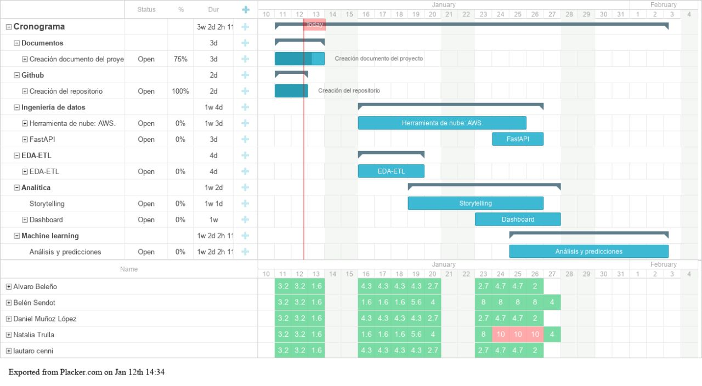
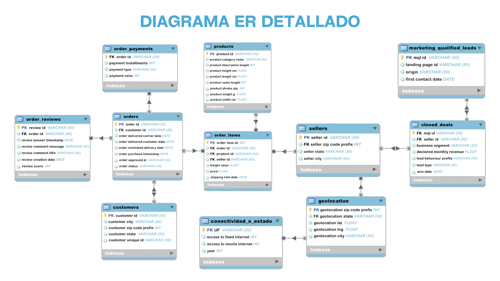

<h1 align="center">Proyecto Final</h1>
<h1 align="center">Análisis de negocio de Olist</h1>
<h3 align="center"><a href="https://github.com/belensendot">Maria Belén Sendot</a> Data Analytics</h3>
<h3 align="center"><a href="https://github.com/damul90">Daniel Muñoz López</a> Data Scientist</h3>
<h3 align="center"><a href="https://github.com/">Natalia Soledad Trulla</a> Data Analytics</h3>
<h3 align="center"><a href="https://github.com/Lautaro-Cenni">Lautaro Alejandro Cenni</a> Data Scientist</h3>
<h3 align="center"><a href="https://github.com/Alvaro9721">Álvaro Enrique Beleño Contreras</a> Data Engineer</h3>

## Introducción

Olist es una compañía que trabaja en el ámbito del e-commerce, cuyo objetivo principal es multiplicar las ventas de lo susuarios por medio de un modelo que permite crear sólidas conexiones entre los *PYMES* y los clientes.

## Objetivo General

Encontrar soluciones innovadoras que permitan a las PYMES vender sus productos a un mayor número de clientes, manteniendo su conexión con los mercados más grandes, y optimizando la experiencia del usuario desde la búsqueda del productoa partir de la plataforma, hasta la entrega de este.

## Objetivos específicos del análisis sobre E-Commerce (Olist)

- **Evaluar** la evolución de la venta de productos por trimestre y por estado entre los años 2016 y 2018, investigando si efectivamente se produjo un crecimiento o disminución en la venta según producto y las regiones.

- **Determinar** cuáles son las localidades mejor ubicadas geográficamente según los tipos de productos y el consumo, para gestionar de forma eficiente el flujo de mercadería desde los centros físicos de almacenamiento, ya sea incorporando nuevas sedes o sumando nuevos productos a los existentes. También determinar cuáles son los estados con poco servicio para posibilitar su llegada a sectores de la sociedad que aún no han tenido esa posibilidad.

- **Evaluar** la experiencia de nuestros clientes a través del índice de recomendación de marca. Esto nos va a permitir entender cuáles son las buenas prácticas que contribuyen a la fidelización de los clientes promotores y analizar la voz del cliente detractor para accionar en consecuencia. Para esto realizamos un análisis de sentimiento.

- **Crear** un modelo de Machine Learning que realice las predicciones en base a los productos más vendidos mes a mes, para cubrir las necesidades de los usuarios acorde a la demanda, estimar la cantidad óptima de reabastecimiento, e identificar aquellos que requieren stock permanente.

- **Identificar** patrones de conversión según la herramienta de marketing para mejorar estrategias de conversion de ventas.

## Alcance
El presente proyecto tiene como enfoque el mercado e-commerce brasileño por lo que cualquier estudio y propuesta será acotada a los límites de Brasil debido a que los contenidos de los datos tienen su completitud en dicho país ya que históricamente Olist ha estado dominando en este mercado.

La propuesta principal va a estar orientada a la calidad de los servicios brindados mediante mejoras de marketing, generar propuestas para mantener un stock fiel a los productos disponibles y agilizar los tiempos de envíos así como tratar de hacer más accesibles los precios de los mismos investigando cuales son las zonas con menor alcance para este servicio.

## KPIs

<table>
    <tr>
        <th> Objetivo</th>
        <th> KPI</th>
        <th>Métrica</th>
    </tr>
    <tr>
        <th>Evaluar la evolución de la venta de productos por trimestre y por estado entre los años 2016 y 2018, investigando si efectivamente se produjo un crecimiento o disminución en la venta según producto y las regiones.</th>
        <th>Variación porcentual de la venta de productos por trimestre y por estado entre los años 2016 y 2018.</th>
        <th>(Ventas_actual - Ventas_trimestre_pasado) / (Ventas_trimestre_pasado) * 100</th>
    </tr>
    <tr>
        <th>Descubrir cuáles son las buenas prácticas que contribuyen a la fidelización de los clientes promotores y analizar la voz del cliente detractor para accionar en consecuencia. </th>
        <th>Grado de fidelización de los clientes: Variación porcentual entre clientes promotores y detractores por mes y estado entre los años 2016 y 2018.</th>
        <th>(% clientes-promotores) / (% clientes-detractores)</th>
    </tr>
        <tr>
        <th>Identificar patrones de conversión según la herramienta de marketing para mejorar las estrategias de venta, ver lo que no fue bueno, mejorar campañas próximas, valorar los éxitos, minimizar los errores cometidos y discutir con el equipo de marketing las conclusiones obtenidas.</th>
        <th>Aumentar el porcentaje de la tasa de conversión en un 10% mensual de herramienta de marketing utilizada según ventas realizadas.</th>
        <th>Closed_deals/total_deals</th>
    </tr>
        <tr>
        <th>Identificar la región con mayor variación de ventas en los periodos 2016-2018, con la finalidad de aprovechar el potencial de cada ciudad.</th>
        <th>Variación del  pronóstico de ventas para poder interpretar  el comportamiento de la industria y poder estimar cómo funcionará el negocio en los próximos meses.</th>
        <th>(Volumen total de ventas/ objetivo de ingresos alcanzados en el periodo) * 100</th>
    </tr>
        <tr>
        <th>Identificar el porcentaje de cancelaciones y los motivos para actuar en consecuencia.</th>
        <th>Disminuir el porcentaje de cancelación en un 25% por mes</th>
        <th>(Total de cancelaciones/total de ventas) * 100</th>
    </tr>
</table>

## Cronograma

## EDA preliminar

- CATEGORY_NAME: Contiene el nombre de los productos en portugues y en inglés, no contiene nulos.
- SELLERS: Contiene ciudad , estado y código de área del vendedor, no contiene nulos.
- PRODUCTS: Contiene las características de los productos como las dimensiones, el peso, la cantidad de fotos, categoría de producto en cuestión (perfumería,artes,etc).
nulos de PRODUCTS: categoría del producto,largo del nombre del producto,largo de la descripción,cantidad de fotos: 1.9%, dimensiones del producto y peso: menos del 0,01% 
- ORDERS: Contiene las características de cada pedido, estado del pedido (enviado,cancelado,etc) y las fechas establecidas: fecha de compra, fecha de envío, fecha estimada y fecha de entrega. Tiene como nulos: fecha de compra: 0.2%, fecha de envío: 1.2%, fecha de entrega: 3%. 
- CLOSED_DEALS: Contiene información acerca de las ventas concretadas, rol asignado a cada vendedor con 21% de datos nulos, que categoría de producto fue vendido con 0.12% de nulos, si tiene empresa con 92.56% de datos nulos, tipo de venta (reventa, manufactura) con 1.19% de nulos, promedios de stock con 92.16% de nulos.
- CUSTOMER: Información de la ubicación del cliente, código postal, ciudad y estado.
- GEOLOCATION: información de geolocalización, con los códigos postales de Brasil, ciudades, estados y coordenadas geográficas.
- MARKETING_QUALIFIED_LEADS: Información del tipo de contacto con el cliente, fecha de primer contacto, página del producto, origen de su búsqueda, esta última variable con un 0.75% de valores nulos.
- ORDER_ITEMS : En este dataset se encuentra información relacionada a los diferentes artículos vendidos, como el Id del vendedor, los precios del productos, costos de envio, fechas maxima de envios, junto con sus respectivos Id, cabe resaltar que cada columna posee un total de 112.650 filas, ninguna de ellas tiene datos nulos y los tipos de datos de cada columna están correctos.
- ORDER_PAYMENTS : En este dataset se encuentra la información de la forma de pago de cada pedido junto con su valor correspondiente, se evidencia que el tipo de dato de cada columna es el indicado y de los 103.886 datos que contienen cada una de estas no se evidencian nulos, lo cual facilita la tarea de análisis.
- ORDER_REVIEWS : Este dataset contiene información de los feedback hechos por distintos compradores, acá se guardan datos relacionados con el puntaje dado, mensaje y su respectivo título, fecha de creación y fecha de respuesta por parte de la empresa, Se evidencia en el dataset que las columnas review_comment_title y review_comment_message tienen un 88.34 % y 58.70 % de datos nulos respectivamente, se hace necesario evaluar la posibilidad de eliminar review_comment_title debido a que no aporta mayor información a un futuro análisis.

## Diagrama de entidad relación

