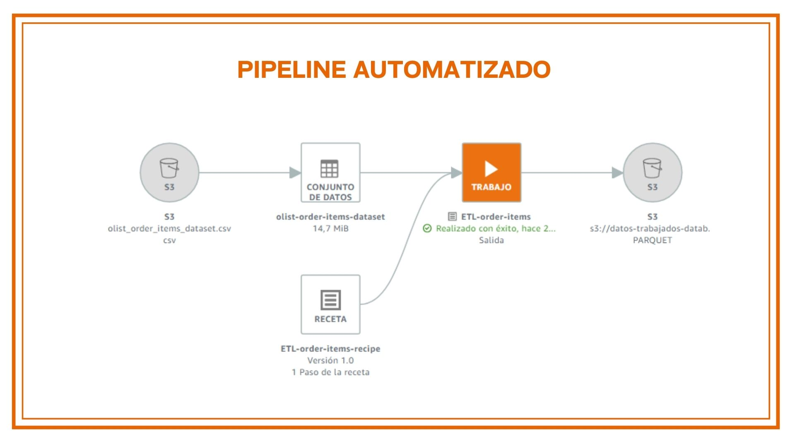
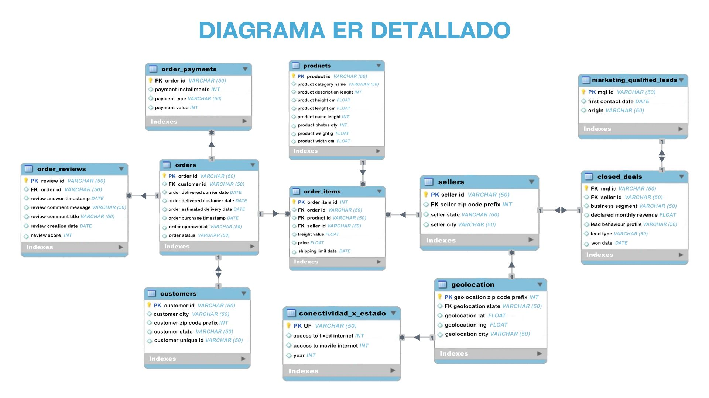
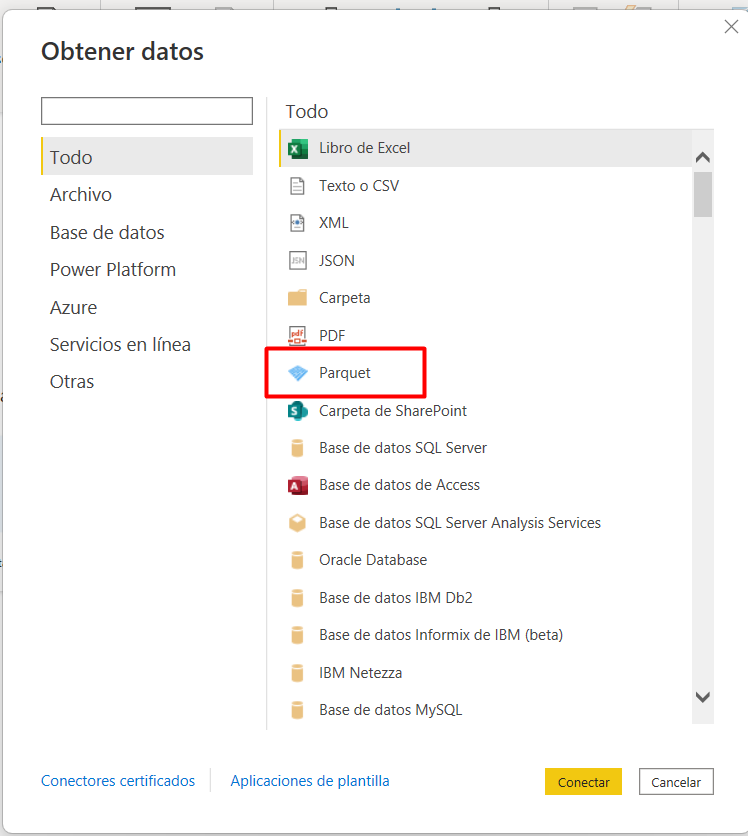
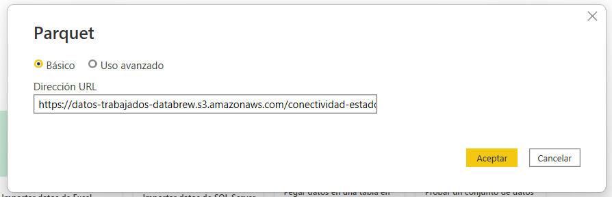
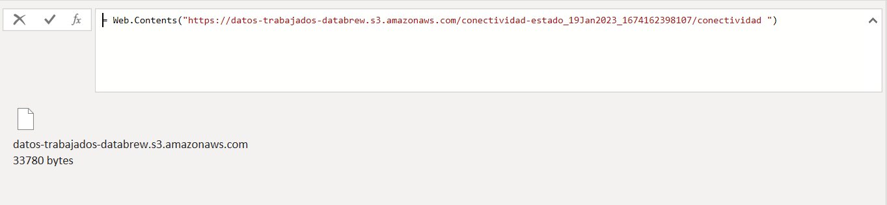

<h1 align="center">Proyecto Final</h1>
<h1 align="center">Análisis de datos del E- commerce brasileño Olist</h1>
<h3 align="center"><a href="https://github.com/belensendot">Maria Belén Sendot</a></h3>
<h3 align="center"><a href="https://github.com/damul90">Daniel Muñoz López</a></h3>
<h3 align="center"><a href="https://github.com/">Natalia Soledad Trulla</a></h3>
<h3 align="center"><a href="https://github.com/Lautaro-Cenni">Lautaro Alejandro Cenni</a></h3>
<h3 align="center"><a href="https://github.com/Alvaro9721">Álvaro Enrique Beleño Contreras</a></h3>

## Introducción

Olist es una compañía que trabaja en el ámbito del e-commerce, cuyo objetivo principal es multiplicar las ventas de los usuarios por medio de un modelo que permite crear sólidas conexiones entre el comercio minorista y los consumidores.

## Objetivo General

Encontrar soluciones innovadoras que le permitan a los comercios minoristas vender sus productos a un mayor número de clientes, manteniendo su conexión con los mercados más grandes, y optimizando la experiencia del usuario en todo el proceso de compra.

## Objetivos específicos del análisis sobre E-Commerce (Olist)

- **Evaluar** la evolución de la venta de productos por trimestre y por estado entre los años 2016 y 2018, investigando si efectivamente se produjo un crecimiento o disminución en la venta según producto y las regiones.

- **Determinar** cuáles son las localidades mejor ubicadas geográficamente según los tipos de productos y el consumo, para gestionar de forma eficiente el flujo de mercadería desde los centros físicos de almacenamiento, ya sea incorporando nuevas sedes o sumando nuevos productos a los existentes. También determinar cuáles son los estados con poco servicio para posibilitar su llegada a sectores de la sociedad que aún no han tenido esa posibilidad.

- **Evaluar** la experiencia de nuestros clientes a través del índice de recomendación de marca. Esto nos va a permitir entender cuáles son las buenas prácticas que contribuyen a la fidelización de los clientes promotores y analizar la voz del cliente detractor para accionar en consecuencia. 

- ** Evaluar** el porcentaje de cancelaciones de las compras para convertirlas en venta, mejorando la falta de stock y la demora en las entregas.

- **Crear** un modelo de recomendación que identifique que productos podrían interesarle a un cliente que haya comprado X producto, según el historial de otros clientes que hayan consumido ese mismo producto.

- **Identificar** cual es el medio de pagos más utilizados para dirigir las estrategia de marketing.

## Alcance

El presente proyecto tiene como enfoque el mercado e-commerce brasileño por lo que cualquier estudio y propuesta será acotada a los límites de Brasil debido a que los contenidos de los datos tienen su completitud en dicho país ya que históricamente Olist ha estado dominando en este mercado.
El crecimiento acelerado de compras en línea necesita ir acompañado de inversiones y oportunidades de mejora para poder diferenciar a la organización por la atención y la buena relación con el cliente y así tener una ventaja competitiva en el área. 
Para poder lograrlo, se formulan los siguientes - **KPI´s:**

## Cronograma del proyecto

<h1 align="center">Composición del dataset.</h1>

## Dataset

El conjunto de datos está compuesto por trece archivos con información sobre:
  - **CUSTOMER**: Se indican datos del cliente como de ubicación.
  - **SELLERS**: Se indican datos del vendedor como id de ubicación.
  - **GEOLOCATION**: Se usa el zip code, latitud, longitud para tener un posicionamiento exacto de ciudades y estados.
  - **ORDER_ITEMS**: En este dataset se encuentra información relacionada a los diferentes artículos vendidos, como el Id del vendedor, los precios del productos, costos de envio, fechas maxima de envios, junto con sus respectivos Id, cabe resaltar que cada columna posee un total de 112.650 filas, ninguna de ellas tiene datos nulos y los tipos de datos de cada columna están correctos.
  - **ORDER_REVIEWS**: Este dataset contiene información de los feedback hechos por distintos compradores, acá se guardan datos relacionados con el puntaje dado, mensaje y su respectivo título, fecha de creación y fecha de respuesta por parte de la empresa, Se evidencia en el dataset que las columnas review_comment_title y review_comment_message tienen un 88.34 % y 58.70 % de datos nulos respectivamente, se hace necesario evaluar la posibilidad de eliminar review_comment_title debido a que no aporta mayor información a un futuro análisis.
  - **CLOSED_DEALS**: Contiene información acerca de las ventas concretadas, rol asignado a cada vendedor, que categoría de producto fue vendido, si tiene empresa, tipo de venta (reventa, manufactura). Resumen: información de la venta y el vendedor.
  - **ORDER_PAYMENTS**: En este dataset se encuentra la información de la forma de pago de cada pedido junto con su valor correspondiente, se evidencia que el tipo de dato de cada columna es el indicado y de los 103.886 datos que contienen cada una de estas no se evidencian nulos, lo cual facilita la tarea de análisis.
  - **MARKETING_QUALIFIED_LEADS**: Información del tipo de contacto con el cliente, fecha de primer contacto, página del producto, origen de su búsqueda.
  - **CATEGORY_NAME**: Contiene el nombre de los productos en portugues y en inglés, no contiene nulos.
  - **PRODUCTS**: Contiene las características de los productos como las dimensiones, el peso, la cantidad de fotos, categoría de producto en cuestión (perfumería,artes,etc).
  - **Nulos de PRODUCTS**: categoría del producto,largo del nombre del producto,largo de la descripción,cantidad de fotos: 1.9%, dimensiones del producto y peso: menos del 0,01%
  - **ORDERS**: Contiene las características de cada pedido, estado del pedido (enviado,cancelado,etc) y las fechas establecidas: fecha de compra, fecha de envío, fecha estimada y fecha de entrega.
  - **Nulos de ORDERS**: fecha de compra:0.2%, fecha de envío: 1.2%, fecha de entrega: 3%.
Se cuenta con registros desde octubre del 2016 hasta agosto del 2018, con más de 100.000 órdenes de pedidos diferentes. Estos son datos comerciales reales, por lo tanto para la protección de identidades se han anonimizado, los clientes, vendedores y socios.
Además se adjunta una TABLA COMPLEMENTARIA:
  - **CONECTIVIDAD_X_ESTADO**: En este dataset se encuentra la información acerca de la cantidad de habitantes que tienen acceso a los servicios de conectividad en general por Estado, por mes y por año. Nosotros tomaremos únicamente la información referida a la cantidad de habitantes que tienen acceso a Internet móvil e Internet fijo. En total son 78 columnas y 3753 registros. La tabla no contiene datos nulos.
Datos obtenidos de https://dados.gov.br/dados/conjuntos-dados/dscom (datos especifícos sobre la distribución del servicio de internet por regiones en Brasil)

## Arquitectura de los datos

Utilizado el dataset público del comercio electrónico brasileño Olist. Se procede a analizar esta información con el fin de encontrar insights que puedan ser transformados en oportunidades de mejora para el negocio.

El proceso de ETL se hace de la siguiente forma:

Como primer paso se crea una bucket S3  en la red AWS que nos va a permitir almacenar los CSV provistos los cuales tienen datos sin trabajar. Estos son consumidos por el microservicio Databrew logrando realizar el análisis preliminar de los datos y posteriormente implementar el ETL de cada una de las tablas cargadas del S3, en este proceso se  disponibiliza una receta(series de pasos) que se asocia a un trabajo con la finalidad de crear un flujo automatizado, entregando los dataset limpios en formato parquet a un nuevo bucket.
Posteriormente se utiliza AWS Glue Data Catalog ya que es el catálogo centralizado de todos los metadatos del Data Lake. Usando una estructura centralizada de metastore, almacena información sobre las bases de datos y tablas que se encuentran en Data Lake, residiendo en Amazon S3 o en orígenes de datos relacionales. Este catálogo centralizado nos permitió tener la misma visibilidad de todas las herramientas analíticas. Por ejemplo, cuando se agrega una nueva columna o agrega un nuevo comentario describiendo un campo, todas las herramientas tendrán esta visibilidad sobre los cambios. 

Con la finalidad de realizar consultas interactivas en la base de datos creada anteriormente y facilitar el análisis de datos se decide utilizar Amazon Athena ya que maneja el lenguaje SQL estándar. Con unas pocas acciones en la consola de administración de AWS, pudimos apuntar Athena hacía la base de datos, logrando ejecutar consultas ad-hoc y recibir resultados en cuestión de segundos.

## Pipeline Automatizado

## Workflow detallando tecnologías en AWS

## Diagrama ER detallado

<h1 align="center">Power BI</h1>

## Carga de los datos

La ingesta de los datos en Power BI  se realiza a través del conector Parquet con el que podemos leer directamente los datos de estos archivos.

  

  

Para conectarnos a un archivo Parquet en un AWS3, debemos usar un URL como este https://datos-trabajados-databrew.s3.amazonaws.com/conectividad-estado_19Jan2023_1674162398107/conectividad . Lo que generará un código Power Query M como este

Como se puede ver en el código Power Query M, se  usó  la función Parquet.Document que es la que entiende el formato Parquet.  
Luego de cargar todas las tablas en Power Bi, se  - **Modelan los datos **-.

  - **Creación de una tabla de tiempo**: Usando el lenguaje DAX con el comando autocalender se crea un calendario que contiene todos los días, meses, años incluso la hora, que va a ir desde el primer registro de fecha de los datos hasta el último. Esta tabla se crea con el objetivo de poder tener un modelo dinámico respecto a las fechas.

- **Creación de relacion entre tablas**: Por último se crean las relaciones entre las diferentes tablas usando las llaves primarias y foráneas. En este caso se usa el customer_id, seller_id, order_id, la tabla calendario, entre otras.
Se busca siempre que las dim_tables apunten y tengan una relación 1 a muchos hacia las fact_tables. También se conecta las tablas de geolocalización con Estados de Brasil y seller a través del geolocalitation_estate.

- **Creación de dashboard**: Con todo lo anterior listo realizamos la creación del dashboard. Primero, se creó una estructura básica con filtros de tiempo, ubicación y categoría y se pusieron tarjetas con información relevante como la cantidad de ventas, de clientes, de órdenes y reseñas de clientes. Además, realizamos gráficos que muestran de la forma más intuitiva la información para su análisis. Por último, se utilizó una paleta con los colores de la empresa para personalizar todo el dashboard.

[Dashboard](https://app.powerbi.com/view?r=eyJrIjoiZWNlMTExM2YtZTM2ZC00OWQ5LWJlNTItODdiNWU1NzVlZjAyIiwidCI6IjYxOGJhYjBmLTIwYTQtNGRlMy1hMTBjLWUyMGNlZTk2YmIzNSIsImMiOjR9&pageName=ReportSection36e877fc4ae0d0603ad4)

## Análisis de ventas según objetivos
Es importante tener en cuenta que se tiene registro de órdenes de productos desde octubre del 2016 hasta agosto del 2018.
Se tiene un crecimiento positivo de las ventas a través del tiempo, se puede observar cómo en cada trimestre del año van aumentando estas. En el tercer trimestre del 2018 este valor disminuye por la falta de registro a partir de esa fecha. Sin embargo, en ese punto ya se ha vendido un 21.54 % más de lo que se vendió en el 2017.
 
## Propuestas y Conclusiones
- **Nuevos Centros de Almacenamiento y Vendedores**
La región Sudeste es donde se realizan más ventas a los vendedores que allí se encuentran con un 83,76% del valor total mientras que en segundo lugar se encuentra la región sur con un 13.27%. En la región Noreste se concretan tan solo el 1.51% de las ventas según la ubicación geográfica de los vendedores, que no se condice con la cantidad de compradores ubicados en esta región. El número de compras según la ubicación de los usuarios es casi tan numeroso como en la región del Sudeste, por lo que la implementación de nuevos almacenamientos en el Noreste no solo ayudaría a cubrir la demanda de stock, sino también mejorar los tiempos de demora del delivery acortándose la distancia entre vendedores y compradores.
Para esto, proponemos también motivar la búsqueda de mayor cantidad de vendedores minoristas en este sector a partir de las herramientas de marketing que mejor funcionan que son la búsqueda paga, la orgánica y la de tráfico directo.
 
-**Estrategias de Marketing**
Agrupando los productos por la categoría correspondiente, pudimos observar que los más vendidos se corresponden con los de Hogar (cama_mesa_banho), Salud y Belleza, Ocio Deportivo (esporte_lazer) y Muebles de decoración (Moveis_decoracao). Creemos que es una buena oportunidad para ofrecer otros productos. En muchos casos, durante una compra, ciertos productos que no tienen tanta promoción o no son valorados por el usuario pueden llegar a complementar el artículo que el cliente ya está comprando. Como ejemplos a tener en cuenta según productos que tienen pocas ventas, ciertos libros de decoración podrían acompañar la venta de artículos del hogar, promociones de salud y belleza podrían estar asociadas a la venta de ropa femenina y masculina así como también de perfumería, para Ocio Deportivo podrían asociarse los productos de la categoría Deportes de moda y junto a Muebles de Decoración podrían ofrecerse obras de arte decorativas que hagan juego con el diseño de los muebles.
 
-**Cuotas sin Interés**
El método de pago número uno con más del 73,92% de las compras, es la tarjeta de crédito, el segundo es el boleto(es un método de pago oficial de Brasil (regulado por el Banco Central de Brasil)) con un 19,04 %.
Independientemente de la categoría, el 50,58% de los clientes pagan una sola cuota, por lo que el 49,42% restante usará más de una cuota para pagar. Para dirigir a los clientes que eligen pagar en más cuotas, a elegir hacerlo en menor cantidad de cuotas, la propuesta es realizar mejores acuerdos con las plataformas de pago y los bancos para ofrecer hasta 3 cuotas sin interés según el monto.
 
-**Beneficios y Descuentos**
Consideramos que la premiación o el reconocimiento de la empresa hacia un usuario por elegirla, puede ser un buen método para fortalecer los lazos con el cliente, para que vuelva a realizar una compra y también ayudará a fidelizarlos.
Para el primer caso proponemos otorgar algunos beneficios y descuentos. Realizamos un cálculo denominado RFM que consiste en categorizar a los clientes según 3 variables: frescura del cliente (que sus compras sean recientes), frecuencia en la compra y la ganancia que aporta a la empresa. Cada uno obtiene un puntaje del 1 al 5 según las variables y luego le es otorgado un número concatenando los 3 resultados. Quienes posean mejor número son catalogados como mejores clientes y podrían obtener descuentos en sus compras, en los costos de envío e incluso en las suscripciones a ciertos servicios mediante convenios con otras empresas.

-**Tiempos de entrega**
Que el producto llegue a término y en buenas condiciones a su destino es fundamental para el crecimiento de la empresa y para fomentar la confianza del cliente.
A partir de nuestro análisis pudimos determinar que hay lugares donde el producto demora más de 30 días en llegar desde la fecha estimada, como aquellos que se compran desde el Amazonas, pero también hay muchos otros que pueden demorar lo mismo para llegar desde lugares más cercanos.
Esto se debe a varios factores: como ya mencionamos la concentración de vendedores en un solo sector, las demoras por tráfico e itinerarios mal organizados, así como también la desorganización en la prioridad de las entregas.
Proponemos optimizar la planificación del ruteo, evitando los puntos con mucho tráfico, diagramando itinerarios cortos y rápidos, también ajustando los trayectos teniendo en cuenta el servicio en tiempo real y hacer coincidir varias entregas de la misma zona.
En este punto la comunicación es fundamental por lo que enfatizamos la necesidad de que el cliente pueda realizar un seguimiento de los estados de su paquete para poder organizarse según eventuales cambios e incidentes.
Para las entregas antes de tiempo, que son el 76,58% de los casos, sugerimos establecer un rango con ciertos días de antelación a la fecha de entrega estimada para facilitar la organización del comprador avisando que es posible que un producto llegue antes de tiempo.
El 13,88% de los pedidos llegan a tiempo mientras que el 6,67% llega tarde y el 2,97% nunca se entregaron. Consideramos que mejorando este aspecto podremos evitar la mayor parte de las cancelaciones que suelen estar asociadas a la demora en la llegada del producto, la falta de confianza con la empresa por mala comunicación y la llegada del producto en malas condiciones.
 
-**Propuesta a largo plazo:** Incorporar un sistema de planificación de rutas mediante algoritmos o programación lineal que sea capaz de organizar en forma automática las rutas diarias de la flota de vehículos para las entregas y las recogidas de pedidos, calcular el recorrido óptimo considerando aspectos como conductores y vehículos disponibles, capacidad del vehículo según la carga, duración del recorrido, puntos de distribución, el tráfico en horarios pico, sentidos de circulación y ubicación del cliente.

## Sistema de Recomendaciones

-**Producto en funcionamiento de Machine Learning:**
Deseamos ofrecerles como producto un modelo automatizado de machine learning de recomendaciones que consiste en realizar predicciones en base a los consumos que realizaron otros usuarios para identificar qué productos podría llegar a interesarle a un cliente que haya consumido algo, según el historial de otros clientes que hayan consumido ese mismo producto. Este sistema sirve a las estrategias de marketing para poder realizar una campaña dirigida y segmentada según las tendencias en el consumo mediante recomendación.

